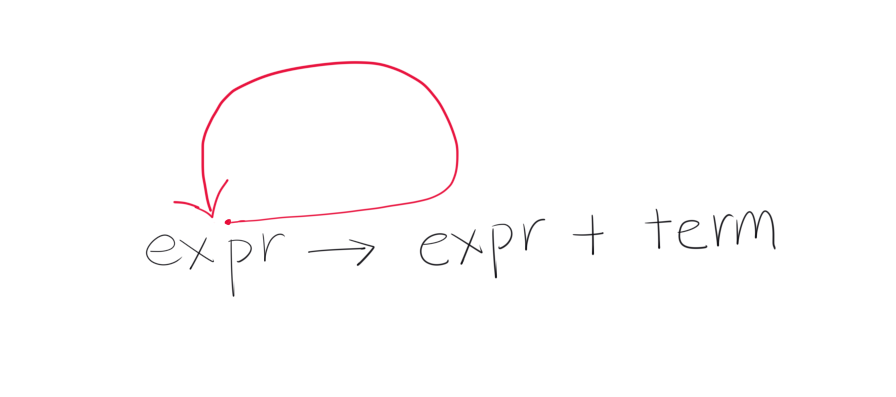

This is WIP...

The left recursion is like a serpent eating its own tail.

In general, a production consists of a nonterminal that represents a set of strings of terminals, together with a fixed
rule that describes how the body can be formed...

